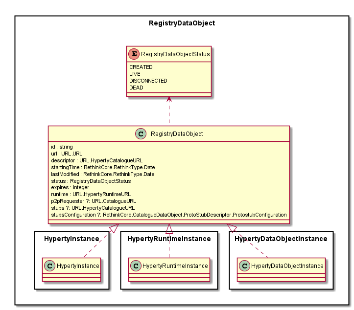
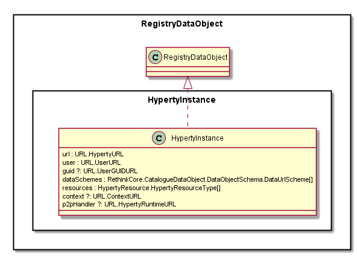
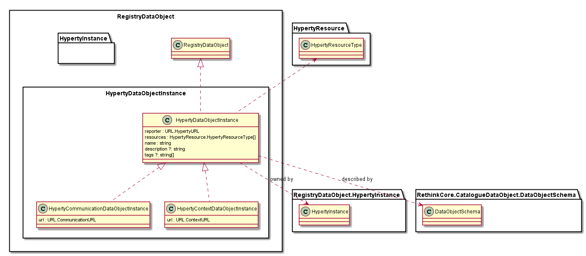
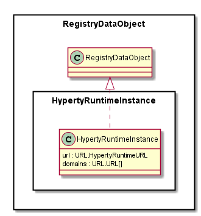

Registry Data Model
-------------------



Registry Data Model includes all Objects to be handled by the Registry functionality including:

-	Data about Hyperty Instances running in Device runtime
-	Data about (data) objects instances handled by Hyperty Instances e.g. communication data objects. This data can be used to manage and keep logs about objects instances handled by Hyperty Instances eg communication / call sessions.
-	Data about connected devices with instances of the runtime where Hyperty instances are running
-	Optionaly, data about instances of protocol stubs used to connect to the Hyperty Messaging Service domain. This data can be used to manage and keep logs about sessions where the user is logged in into the domain.

Each of these objects share a common set of data:

-	Id: unique identifier in the context of the Registry domain
-	URL: address to reach the instance. The URL type will depend on the Registry Data Object class eg for Hyperty Instance it will be HypertyURL (see below)
-	descriptor: a link to the Catalogue from where the descriptor of the instance can be retrieved
-	the starting date and the last time the Instance was modified. The dates format must be compliant with [ISO8601](https://en.wikipedia.org/wiki/ISO_8601)
-	status: the instance status ("created", "live", "disconnected" or "dead")
- expires: period of time in seconds about how long a registry entry is "alive" without receiving an update message.
-	stubs: the protocol stubs descriptor (including the deployable protocol stub package) that can be used to reach the registered Object including Hyperty Instance, Hyperty Runtime and Data Objects. The protocol stub can be used to reach the Object instance through a Message Node or directly connect to the Object Instance runtime (full P2P connection)
-	stubsConfiguration: configuration data required when deploying stubs used for P2P connections.
- **Phase 2 new!!** the `runtime` defines the URL of the runtime where the Hyperty instance is deployed.
- **Phase 2 new!!** The `p2pRequester` defines the Catalogue URL of a [P2P Requester protocolStub](../../../messaging-framework/p2p-msg-delivery.md) that can be used in order to setup a P2P Connection with this Registry instance.

### Hyperty Instance



The Hyperty Instance Data Model is used to model instances of Hyperties running in devices and servers.

The Hyperty Instance object contains:

-	Its URL ([HypertyURL](../../address/readme.md#hyperty-instance-address)) that can be used to reach the Hyperty Instance

-	the Hyperty Descriptor URL ([HypertyURL](../address/readme.md#hyperty-address)) that can be used to consult hyperty metadata

-	the User URL or User GUID URL ([HypertyURL](../address/readme.md#user-url-type)) which identifies the user that is associated with the Hyperty Instance.

- the Objects URL Schemes supported by the Hyperty.

- **Phase 2 new!!** The `p2pHandler` defines the Runtime URL of a [P2P Handler protocolStub instance](../../../messaging-framework/p2p-msg-delivery.md) deployed in the Hyperty instance runtime.


-	the Context URL for the user associated to the Hyperty Instance, which may include Presence information.

Example:

```
 "hypertyDescriptorURL" : "hyperty-catalogue://catalogue.<sp-domain>/<catalogue-object-identifier>", "hypertyURL" : "hyperty://<sp-domain>/<hyperty-instance-identifier>", "hypertyRuntimeURL" : "hyperty-runtime://sp1/runalice",
```

### Hyperty Data Object Instance (or Hyperty Data Object sessions)



Hyperty Data Object Instance contains data about (data) objects instances handled by Hyperty Instances e.g. communication data objects. This data can be used to manage and keep logs about data object instances handled by Hyperty Instances eg communication / call sessions. It identifies the Hyperty Instance that owns (has created) the data object. HypertyContextDataObjectInstance and HypertyCommunicationDataObjectInstance are two examples of hyperty data objects instances that are reached through different URL types, namely ContextURL and CommunicationURL addresses.

### Hyperty Runtime Instance



The Hyperty Runtime Instance contains data about connected devices featuring Hyperty runtime. It contains the URL of the Device Runtime ([HypertyRuntimeURL](../address/readme.md#device-runtime-address)) which identifies the runtime where the hyperty instance is running, its descriptor and the list of domains from Hyperties running in this device.
