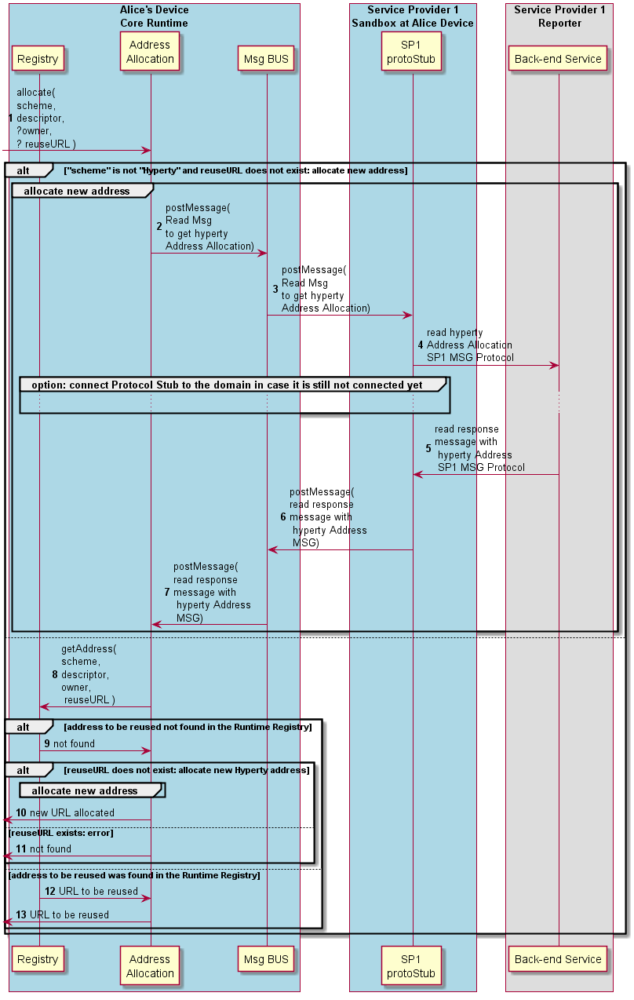

#### Allocate Address

**Phase 2 New!! Adddress Allocation is now a separated process, similar to Hyperty addresses and Data Object addresses**

The Runtime procedures to allocate a new address to Hyperties or Data Objects are described in this section.

Step 1: the address allocation is requested (either by the Runtime UA for Hyperty addresses or by the Sync Manager for Data Objects addresses. Optionaly, a reuseURL is provided in case the App or the Hyperty wants to reuse a previously used address. The Address owner is also optionally provided. For Hyperty addresses the owner is the user associated with the Hyperty, for Data Objects the owner is the Reporter Hyperty.

Steps 2: **Phase 2 New!** The address allocation asks the Runtime Registry if there is a previously registry to be used. If the "reuseURL" is provided the Runtime Registry checks if that address is reusable ie if an existing registry matches the info provided.

Steps 3 - 9: If the Runtime Registry returns "Not Found", an address is allocated in cooperation with the Msg Node Address Allocation functionality ([Create Message](../../messages/address-allocation-messages.md#address-allocation-request)).

Step 10: otherwise, if the Runtime Registry returns an Address, no further address allocation tasks are performed.

Steps 11: the allocated address is returned with information about if this is a new allocated address or not
