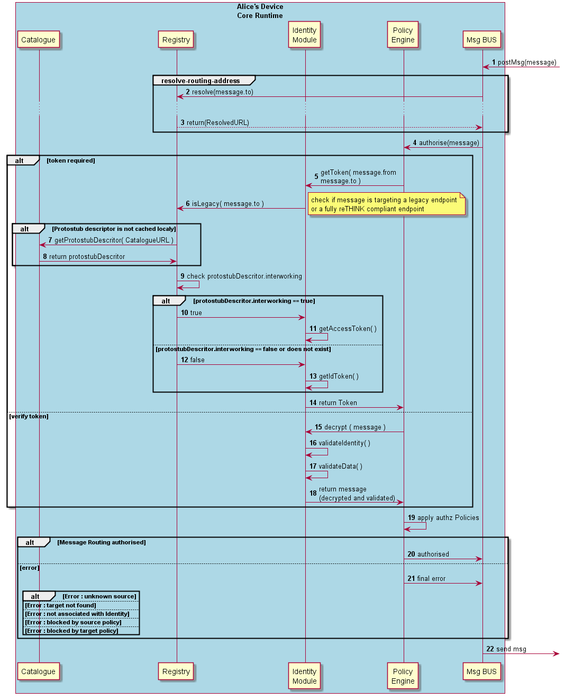

#### Message Routing in Message BUS

The Runtime procedures to route a message by the Runtime BUS are described in this section.

Steps 1 - 3: on receiving a message, the Runtime BUS requests the Registry to verify if the originator is valid (3) (i.e. its Runtime URL has been previously registered) and the Message Bus asks the Runtime Registry to [resolve the Message](resolve-routing-address.md).

Steps 4 : the message routing is subject to authorisation by the Policy Engine. Before enforcing the policies, the Policy Engine asks the Identity Module to secure the message delivery:

  Steps 5-7: for outgoing messages ie messages are coming from the originator Hyperty (`message.from`), the Identity Module adds identity assertions and encrypts the message.

  Steps 8 - 11: for incoming messages ie messages are requested to be delivered to the target Hyperty (`message.to`), the Identity Module decrypts the message and validates the identity assertion as well as the mesage content.

Steps 12 - 13: The Policy Engine enforces authorisation policies and if successful, the message is returned to be routed.

Step 14: if not successful different types of errors may occur and corresponding error message should be replied to the originator:

-	target does not exist
-	Hyperty instance that is sending the message is not associated with an appropriate Identity
-	the message is blocked by a source or target policy
