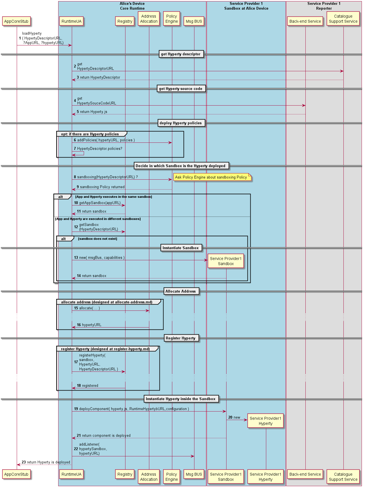

The Runtime procedures to deploy a new Hyperty are described in this section.



TODO: the loadHyperty should have the following:

```javascript
// hypertyCatalogueURL -  hyperty-catalogue://<domain>/.well-known/hyperty/<name of hyperty>
// resuseURL - default = false | Possible options: true | false | hyperty://<domain>/<id>
// appURL
loadHyperty(hypertyCatalogueURL, reuseURL = false, appURL)
```

Steps 1 - 5: the Runtime UA is invoked by the App to load a new Hyperty from a specific URL, (**Phase 2 New!**) passing the App URL and optionally an Hyperty URL to be reused. The Runtime UA downloads the Hyperty source code, extracting the HypertyDownloadURL from the Hyperty descriptor.

Steps 6-7: policies contained in the Hyperty Descriptor, are deployed in the Core Policy Engine.


Steps 8-9: the Runtime UA asks the Policy Engine about Hyperty sandboxing policy. As discussed in the Runtime Architecture, and according to security policies, Hyperties and the Application can be deployed in the same sandbox or in separated domains.

---

**Hyperty and App deployed in the same sandbox**

In this situation, the App and the Hyperty are running in the same isolated sandbox which is different from the Hyperty Core Runtime Sandbox.

Steps 10 - 11: The Runtime UA retrieves the App sandbox from the Registry **(Phase 2 New!) passing the App URL**, and requests the App sandbox to deploy the Hyperty source code, extracting the configuration data from the Hyperty descriptor. Then the App Sandbox is registered in the Msg Bus to receive messages targeting the new Hyperty.

**Hyperty and App deployed in different sandboxes**

In this situation, the App and the Hyperty must run in different isolated sandboxes.

Steps 12: The runtime UA should avoid the creation of new sandboxes in case there is already a sandbox for the same domain

**Sandbox does not exist**

Steps 13-14: In case no sandbox exists, the Runtime UA instantiates a new sandbox through the SandboxFactory interface (not shown) which is registered in the Registry. **Phase 2 New!** The `constraints` input parameter (see RuntimeCapabilities type in [Runtime Descriptor](../../datamodel/core/hyperty-catalogue/readme.md#hyperty-runtime-descriptor)) is used to indicate constraints to be met by the sandbox eg window capabilities.

---

Steps 15 - 16: an [address is allocated to the new Hyperty](allocate-address.md).

Steps 17 - 18: the new Hyperty is [registered in the Runtime Registry](register-hyperty.md).

Steps 19-21: The Runtime UA requests the Hyperty sandbox to deploy the Hyperty source code, extracting the configuration data from the Hyperty descriptor.

Steps 22-23: the runtime UA adds Hyperty Sandbox listener to the runtime BUS to receive messages targeting the Hyperty URL.
