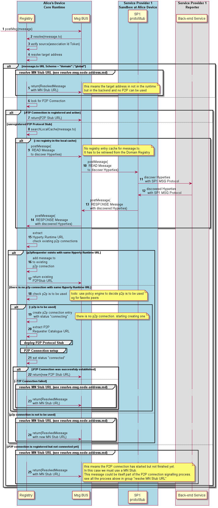

#### Resolve Routing Address

This section describes how the Runtime Registry procedures to resolve a routing address during the [Message Routing process](bus-msg-routing).

Steps 1 - 2: when the Message Bus does not find listeners to deliver the message it asks the Runtime Registry to resolve the address where the message should be forwarded to. This means the `message.to` address is an external address that does not belong to the runtime and should be routed through a protocol stub.

Steps 3: Registry verifies the originator is valid i.e. its Runtime URL has been previously registered.

**Phase 2 New!** Steps 4 - 5: the registry verifies if the address to be resolved if from a backend service ie if the URL scheme is "domain" or "global". If yes, the [MN Stub URL is resolved](resolve-msg-node-address.md).

**Phase 2 New!** Steps 6 - 7: if the address to be resolved is under the scope of the runtime, the registry will give more priority for the usage of P2P Connections. Thus it looks for one P2P Connection that is registered and connected for for the requested "message.to". If found, that is the one that is returned.

**Phase 2 New!** Steps 8 : in case no p2pConnection is registered for the requested "message.to" it looks for an existing p2p connection registered for the same remote Hyperty Runtime URL since each P2P Connection entry should contain the remote runtime URL, executing Hyperty URLs and reporting data object URLs. The first task is to check if the registry entry for "message.to" is locally stored in the runtime registry.

  **Phase 2 New!** Steps 9 - 14: If not found, it queries the Domain Registry for it, using a [Read Request Message](../../messages/registration-messages.md#query-per-registry-data-object-url).

  **Phase 2 New!** Steps 15 - 17: the Hyperty Runtime URL is extracted from the registry entry and it looks for an existing registered p2p Connection with the same Hyperty Runtime URL. If found, the "message.to" is associated to the existing p2p connection stub and its URL is returned.

  **Phase 2 New!** Steps 18 - 22: If there is not registered p2p Connection with the same Hyperty Runtime URL, it checks with Policy Engine if a P2P Connection is to be used. *todo: at this point the Policy Engine is not used and P2P connections are always established, if possible.* If yes, the P2P Requester catalogue URL is extracted from the [registry object entry](../../datamodel/core/hyperty-registry) which is used to [deploy-protostub.md](load and deploy the P2P Requester Protocolstub). As soon as the P2P Requester Stub is activated it performs [the P2P Connection Setup](p2p-setup.md) and returns the runtime URL of the new P2P Stub URL to the Message Bus.

  **Phase 2 New!** Steps 23: If it is not possible to use a P2P Connection, the process to [resolve the Message Node protostub Runtime URL ](resolve-msg-node-address.md) is performed.

**Phase 2 New!** Steps 24: If a P2P Connection is not to be used, the process to [resolve the Message Node protostub Runtime URL ](resolve-msg-node-address.md) is performed.

**Phase 2 New!** Steps 25: If there is a P2P Connection registered but not connected yet, this means the P2P connection has started but not finished yet. In this case we must use a MN Stub, the process to [resolve the Message Node protostub Runtime URL ](resolve-msg-node-address.md) is performed. This message could be itself part of the P2P connection signalling process.
