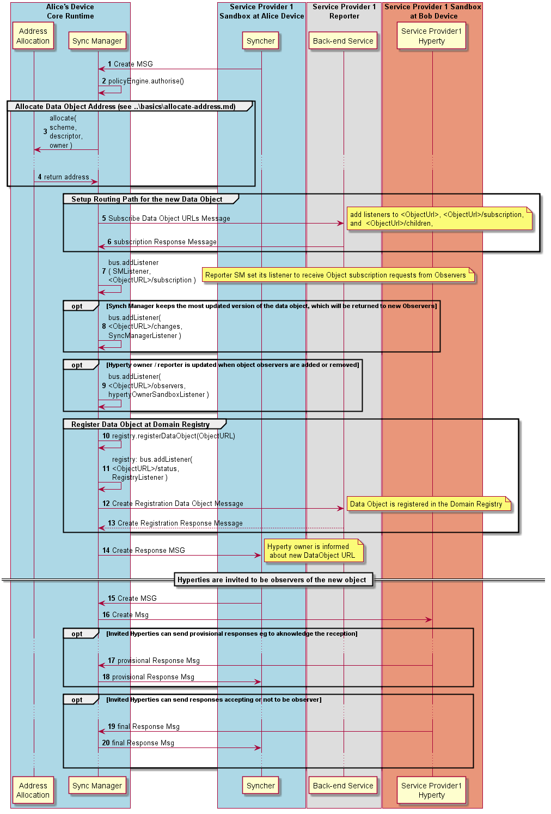

#### Data Object Creation by Reporter

This MSC diagrams shows the most relevant steps to support the setup of data object synchronisation.

Steps 1-2 The Data Object reporter post a [Create Message](../../messages/data-sync-messages.md#hyperty-data-object-creation) to initiate the setup of the Data Object synchronisation. The Core Police Engine applies policies to check whether Alice has permissions to create the data object.

Steps 3-4: **Phase 2 New:** [address is allocated to the data object](allocate-address.md). In case the reporter provides an existing ObjectURL and if the returned allocated address confirms the adddress is reused, this means it is the resume of a Data Sync Stream and Steps 5 - 6 are not performed.

  Steps 5 - 6 : If this is a new Data Object sync, the Routing Path has to be set at Reporter Message Node Subscription Manager functionality ([Subscribe Message sent to Message Node Subscription Manager](../../messages/data-sync-messages.md#reporter-data-sync-routing-path-setup-request-at-reporter-message-node-for-a-new-data-object)).

Step 7 - 8: The new address allocated to the Data Object is returned back to the Reporter with a [response message](../../messages/data-sync-messages.md#response) and the sync manager adds its listener to receive subscription requests from observers.

Step 9: Optionally, and again, according to applicable policies, a Sync Manager listener is added to receive updates about the data object that will be returned to new Observers.

Step 10: Optionally, and again, according to applicable policies, the Reported Hyperty is added as a listener to be notified when new Observers to its Data Object are added or removed. The DataObjectObserversURL is handled by the Policy Engine.

Step 11: The data object is registered in the Registry, which includes the allocation of the ObjectURL.

Steps 12 - 18: In case this is a new data object a ([Create Message is sent to Domain Registry](../../messages/registration-messages.md#registration-request)) and the a [data object creation message is sent to invited Observers](../../messages/data-sync-messages.md#observer-invitation) and the Core Policy Engine takes the Hyperty Instance URLs set in the `to` header field, to set as the list of addresses that are previously authorised to be Observer for the new data object. Optionally, invited Observers may [respond e.g. to aknowledge the reception of the invitation and to accept or not the invitation to be an Observer](../../messages/data-sync-messages.md#response-3).

 Steps 19 - 20: **Phase 2 new:** in case this is the resume of a Data Sync Stream, an ([Update Message is sent to Domain Registry](../../messages/registration-messages.md#update-registration-to-live)) and there should be no new observer to be invited.
