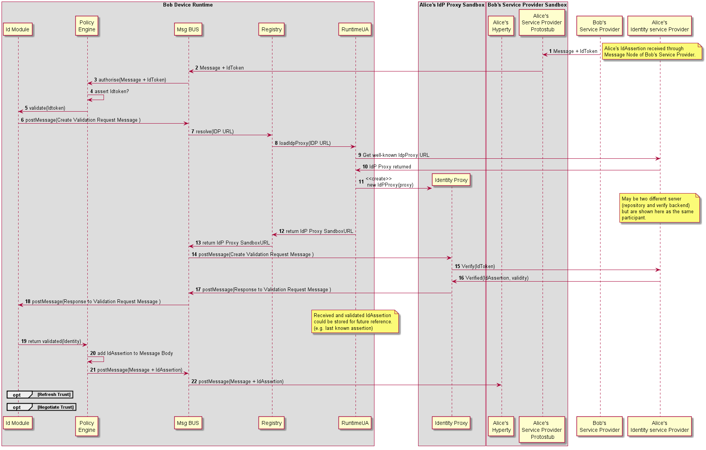

Message bodies can contain JWT tokens for Access Control or for Identity Assertion purposes that are inserted by the Identity Module before the message is routed to protostubs.

When these messages reach the destination MessageBUS, the JWT tokens are decoded and translated into standard [User Identity Data format](../user-identity).

According to applicable policies, IdTokens are verified by the Identity Module and, if successful, `"assertedIdentity" : "true"` is inserted in the MessageBody. These procedures are performed before the message is delivered to the Hyperty.

In this sequence, Bob's runtime receives a message from Alice with her Id Token. Before delivering the message, the policy engine checks Bob's policies and if applicable, the Runtime Identity Module requests Alice's IDP to verify her IdAssertion through Alice's IDP Proxy.
In case Alice's IDP Proxy is not deployed yet, the Runtime Registry asks the Runtime UA to deploy and instantiate Alice's Idp Proxy by performing the [Protostub Deployment procedure](../basics/deploy-protostub.md).

Communication between the Identity Module and the IdP Proxy is done through the Msg bus.

If the IdToken is validated, the Identity Module confirms the validity to the Policy Engine, which inserts in the Message Body the validated Identity data with `assertedIdentity = true`, and authorises the message delivery to Bob's Hyperty. As soon as Bob's Hyperty receives Alice's message, it can trustfully presents Alice's identity data to Bob.
