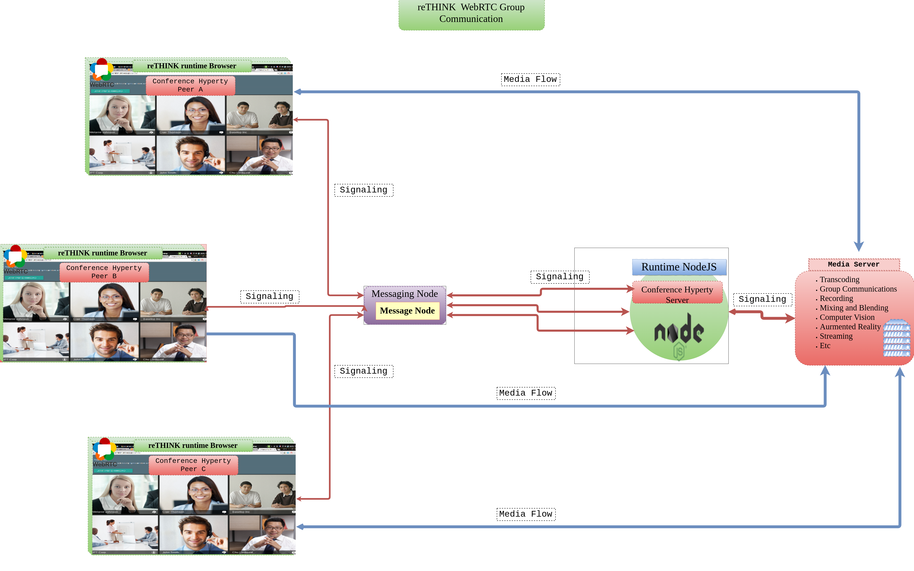

## Group Communication

*to provide here Multiparty / Group Communication related specification defining architectural functionalities and concepts involved. A dynamic view should be provided [here](../dynamic-view/group-communication/readme.md) with MSC diagrams and the specification of messages would be provided [here](../messages/group-communication-messages.md)*

The goal of this repository, is to provide specifications for enabling WebRTC group call in reTHINK (aka WebRTC Multiparty). 
an ongoing discussions about these specs have been documented here [WebRTC Multiparty #106](https://github.com/reTHINK-project/dev-runtime-core/issues/106#issuecomment-245019063).Besides,in this issue more details and arguments can be found as well.

In summury, star topology having an intermediary media server seems to be a good candidate for scalable group communication.
This start topology, decribes H2H WebRTC group communication between reTHINK users. Therefore, hyperties running on runtime browsers can exchange signaling descriptions between each other and the media server through reTHINK edge server.

Moreover,in order to exchange signaling descriptions with this intermediary media server, reTHINK runtime nodejs [dev-runtime-nodejs](https://github.com/reTHINK-project/dev-runtime-nodejs) is justified choice for exchanging WebRTC signaling.In addition, runtime nodejs is a fully conform with reTHINK specs. 

Figure 1 below provides a big picture of this star topology, we have proposed. In this star topology, we have three main components: `Client conference Hyperty` running on `Runtime browser`, `Server Conference Hyperty` running on `Runtime NodeJS`, and the `Media Server`. While, the messaging node is just relay point in reTHINK framework. Thus, it's transparent for the different communication messages.

  Figure 1 : reTHINK Multiparty WebRTC overall architecture

- Runtime browser implementing Client conference hyperty silmilar to Hyperty connector, but adapted for conferencing purposes.
- Runtime Node loading and executing Server conference hyperty. This intermediary server is used for webRTC signaling between client conference hyperty and Kurento Media server. This Server conference hyperty will act as proxy between reTHINK framework and kurento media server.
Once the signaling is done, media streams start flowing directly between participants Runtime browsers through the media server.
Concerning the orchestrator hyperty, we think is good idea to have this feature on the

Server conference hyperty running on the Runtime Node. In fact, this hyperty will orchestrate other clients' conference hyperties. In addition, this hyperty has the ability to observer several clients' connections data objects. Each clients conference hyperty will be associated to a connection data object(for which he's the owner). 

