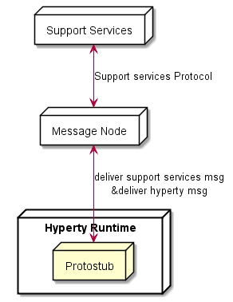
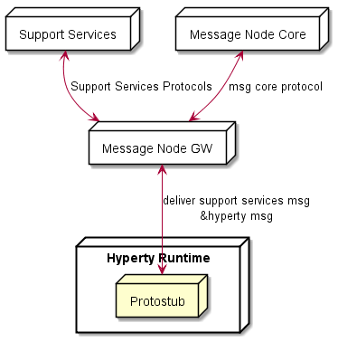
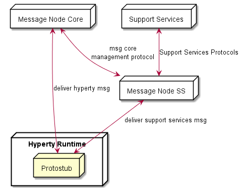

The protocol stubs (AKA protostub) play a central role in the protocol on-the-fly concept. A stub is the piece of code that a reTHINK runtime downloads, instantiates and executes on-the-fly in order to exchange messages with a backend system from the own or a foreign domain. From the runtime's point of view the stub is the required "glue" between the reTHINK Message Model and the backend domain's protocols. The stub implements a well defined interface for the bi-directional asynchronous exchange of messages and hides all potential complexity of protocol translations for the interoperability with the backend domain.

The communication endpoint of a stub in a domains backend is the Messaging Node (MN). The MN and the stub build a unit that shall be designed and implemented together. The implementor of a protocol stub and the corresponding MN has to take some decisions:

1- is the Message Node able to route native reTHINK JSON Messages and no protocol translation is required in the protostub?

2- is it possible to add (with a reasonable effort), Message address allocation and Subscription Management support services functionalities as well as required connectors to interact with reTHINK back end services (including Domain Registry, Global Registry and Identity Management support services) to the Message Node?

If answers to above questions are yes, probably the most appropriate Message Node topology is the standalone message node model where all functionalities are provided by a single message node service and its associated protostub. This topology is used by [Vertx Message Node](https://github.com/reTHINK-project/dev-msg-node-vertx) and [NodeJS Message Node](https://github.com/reTHINK-project/dev-msg-node-nodejs).

If answer to question 1 is negative, the potential complexity to be placed in the stub itself should be evaluated: Shall the stub do everything that is necessary to translate the protocol to the backend domains specifics? Or shall the stub just forward messages and let the MN perform the major tasks of the protocol translations? These are some hints that the developer should take into account:

3-	Does the stub have dependencies to additional libraries? This might blow up the size of the stub and may complicate its deployment. Perhaps there is a chance to avoid some external dependencies?

4-	Do any parts of the stub and it's dependencies underlie special restricting licenses or do they contain code that holds intellectual properties that shall be protected? Since the code is downloaded to an unknown, "strange" environment this might be an issue.

5-	How much resources (network, processing, memory etc.) does the stub require? Are these requirements compatible with all addressed runtime platforms?

These questions shall be kept in mind, when the design decisions for a stub/MN couple are made. If one of the above questions can be answered with yes, then it might perhaps be an option to implement a basic stub that uses a simple connection mechanism like a WebSocket or similar to forward the reTHINK messages directly to the MN. In this case the MN itself would be responsible for the required protocol translations on the server side for its domain.

An example for such a situation is the [Matrix.org based MN](https://github.com/reTHINK-project/dev-msg-node-matrix) and its stub. The decision was made to let the stub just forward reTHINK messages and therefore keep it simple and small. The implementation of the Matrix.org client logic was done on the MN side. If the stub had implemented a full Matrix.org client, there would have been a set of dependent SDK-libraries with their own set of dependencies each. Furthermore a Matrix.org client produces additional overhead traffic that should be restricted to the MN internal system and therefore be kept away from the runtime device.

Another aspect to be taken into account is whether the Message Node is based on an existing Messaging solution that is already in production (e.g. core IMS, cloud messaging like pubnub, firebase, etc). In this case Messaging Node specific functionalities (allocation manager, subscription manager, registry connector) can be provided by a separated Support Service server, while Hyperty messages are delivered to the messaging core. This means, the protostub would handle two different protocols connections as shown below.

