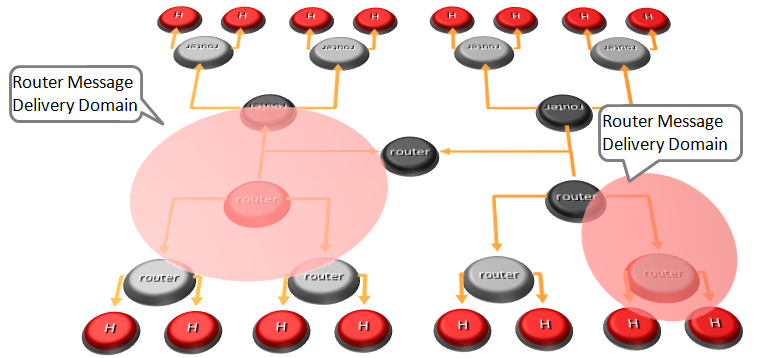
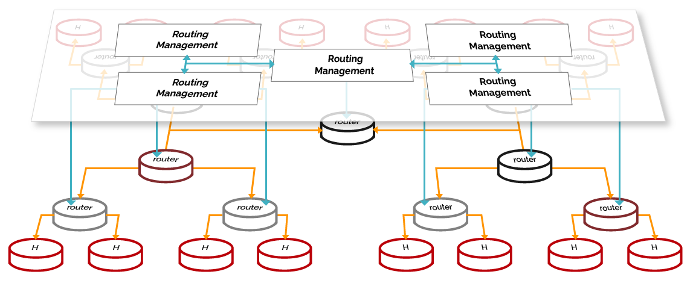
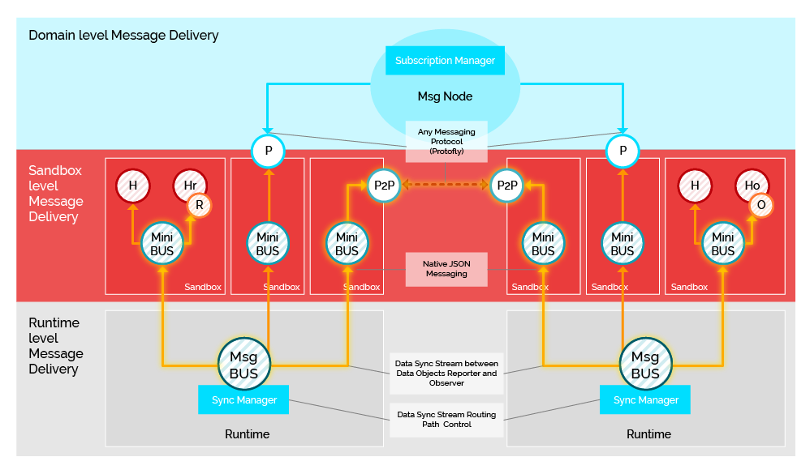

The Decentralized Messaging Framework is designed on top of a Resource Oriented Messaging model that supports publish/subscribe as well as request/response messaging patterns. Messages are used to perform CRUD operations on resources handled by communication endpoints, for example to create or update a WebRTC connection. In addition, Subscribe operations on resources are also supported in order to be notified on any change performed to such resource. The current reference implementation uses JSON for the message format. Each message has a fixed set of header fields and a variable message body. These are the common header fields that are required to route Messages:

**id**: an identifier used to associate RESPONSE messages to the initial REQUEST message

**from**: the address of the entity that sends the message.

**to**: the address of the recipient.

**type**: identifies the operation to be performed by the recipient when it receives the messages, including *create*, *read*, *update*, *delete*, *subscribe* and *unsubscribe*.

The Message **Body** is composed by different types of information depending on the type of operation to be performed. For example for *create* type messages, the body contains a value field containing a data resource to be created by the recipient:

```
{
"id" : 1
"type" : "create",
"from" : "hyperty-runtime://<sp-domain>/<runtime-instance-identifier>/registry",
"to" : "domain://registry.<sp-domain>",
"body" : { "value" : <RegistryDataObject> }
}
```

The Message delivery is based on a simple message Router functionality that performs a lookup for listeners registered to receive the Message. The Message is posted to all found listeners, which can be other Routers or the final recipient end-point.
Thus, the Messaging Framework is comprised by a network of Routers where each Router only knows adjacent registered Routers or end-points.




Listeners are programmatically registered and unregistered by Routing Management functionalities, which take their decisions according to a higher level view of the Routing Network.




The Messaging Framework works at three layers:

At the Runtime Sandbox level where services are executing, message delivery is provided by the [MiniBUS component](https://github.com/reTHINK-project/dev-runtime-core/blob/master/src/bus/MiniBus.js).

At the Runtime level where Sandboxes are hosted (e.g. in a Browser or in a NodeJS instance), message delivery is provided by the [Message BUS component](https://github.com/reTHINK-project/dev-runtime-core/blob/master/src/bus/MessageBus.js), which is an extension of the MiniBUS.

At Domain Level, message delivery is provided by the [Message Node](msg-node.md) functionality by using the [Protofly mechanism](../concepts/protofly.md), i.e. communication between Message BUS and Message Nodes and among Message Nodes are protocol agnostic. This also means that the Message Node can be provided by any Messaging solution as soon as there is a Protostub available. Currently, a [Vertx Message Node](https://github.com/reTHINK-project/dev-msg-node-vertx), a [Matrix Message Node](https://github.com/reTHINK-project/dev-msg-node-matrix) and a [NodeJS Message Node](https://github.com/reTHINK-project/dev-msg-node-nodejs) are provided. These are just reference implementations of Message Nodes and anyone is free to develop its own Message Node. Check the [Message Node design guide](msg-node-design.md) and the [Protocol Stub specification](stub-specification.md) for more details.




At runtime level (MessageBUS and MiniBUS), it is used a standard CRUD based [JSON Message Model](../datamodel/core/message/readme.md), which is easily mapped into Restfull APIs.
