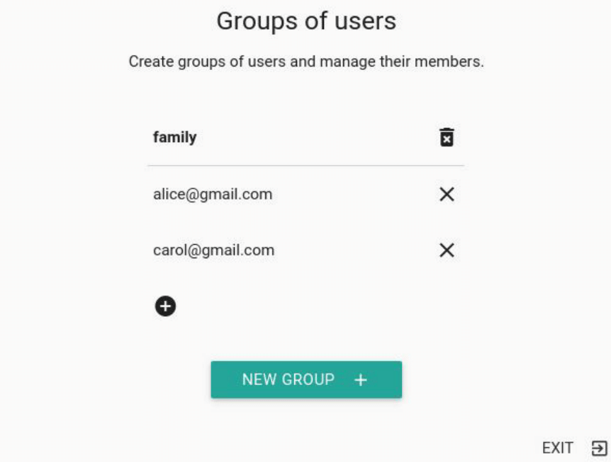
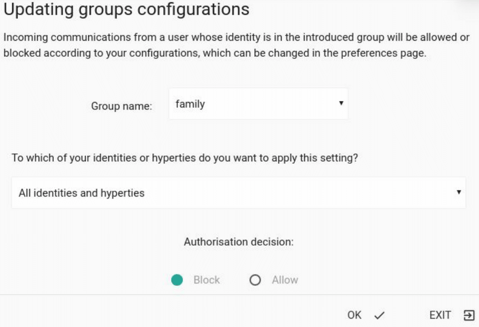
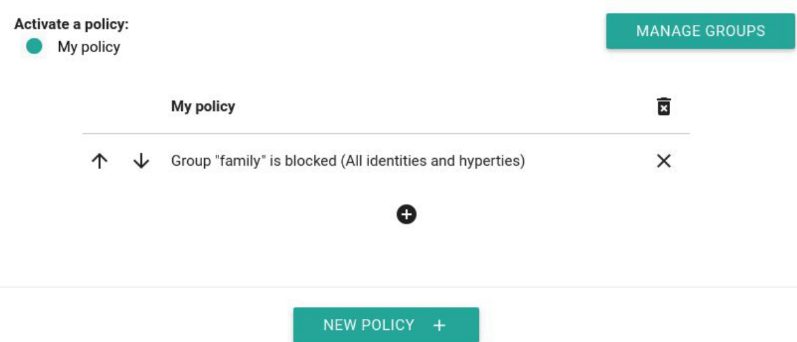

# Administration Page

The end user is not expected to understand a policy specification language. Therefore, it is provided a friendly interface for the browser where the user can specify his preferences. The interface is divided in three main sections: the first section provides the means to create, list, and delete existing policies and rules; the second section allows to create, list, and delete groups of users; and the third section allows the definition of new rules configurations by selecting the type of the condition and filling the input fields to set the preference configurations. Consider the following example: Bob had a huge fight with his sisters, Alice and Carol, and does not want to hear from them soon. To block all their contact attempts, she uses the reTHINK administration page to create the *family* user group, which has Alice and Carol contacts added, and creates a rule to block that group. To do so, the following steps must be performed:

1 - Open the policy administration page (Figure 1) and click on the 'Manage groups' button;

2 - Create a new group named 'family' and add Alice and Carol emails to it (Figure 2).

3 - Create a new policy by clicking on the 'New policy' button of the policy administration page (Figure 1) and select 'Group of users' from the dropdown to create a rule;

4 - In the rule configuration section, 'Group name' field, pick the *family* group, apply this setting to all identities and hyperties, and select the 'Block' authorization decision (Figure 3);

5 - The policy administration page now should have a new policy with one rule stating that the *family* group is blocked for all identities and hyperties (Figure 4).

The specification of other types of rules follows a similar process, only differing in the input fields of the rule configuration section. Adding to the presented one, it is possible to specify rules that restrict communication based on all attributes supported by the Policy Engine: the time of the day, date, weekday, source email, source domain, communication type, data object scheme and subscription preferences. After submitting the configurations in the user interface, they are translated by the Policies Manager to the policy specification language. The Policies Manager creates a policy using the formal syntax and uses the Policy Engine API to add the new policy to PoliThink.
