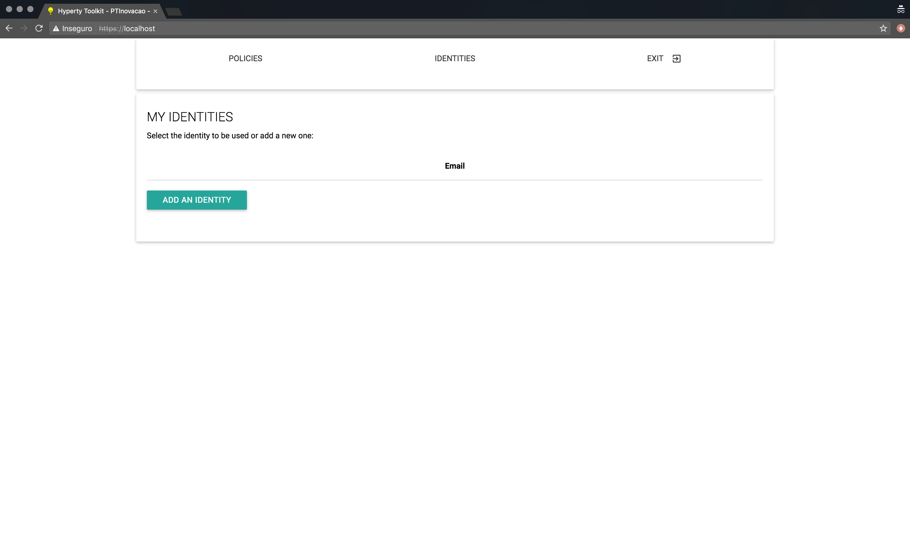
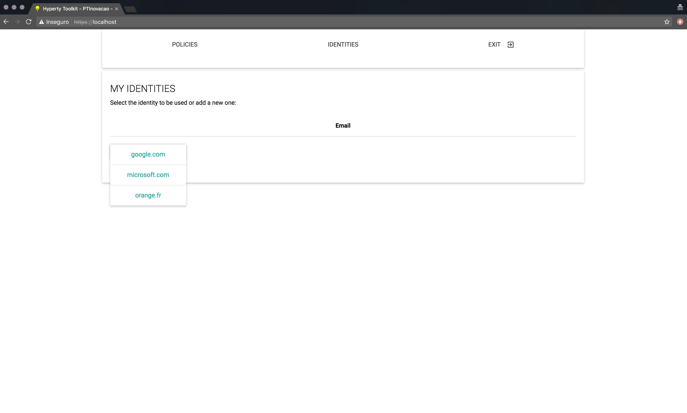
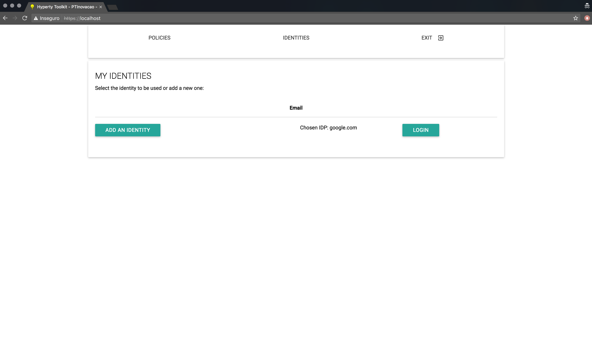
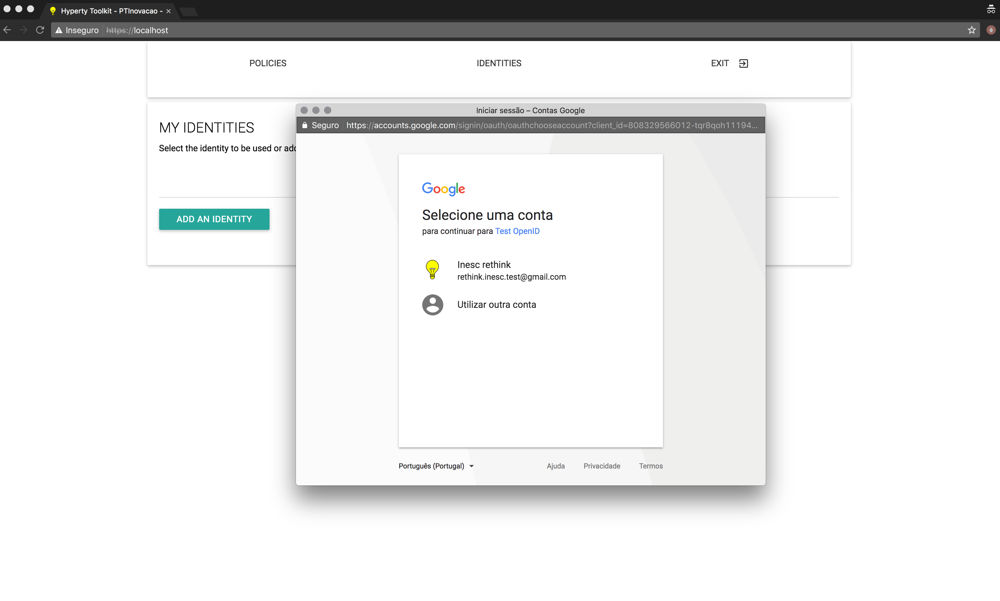
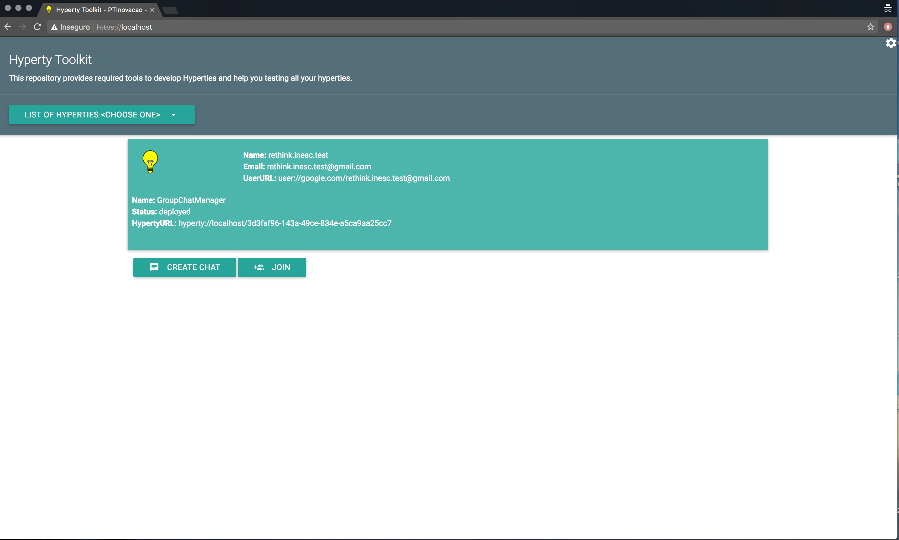

## Description of Component
ReThink identity management is based on several components that are working together:
* The Identity Module (Id Module) is a component of the runtime. It is the component responsible for handling the user identity and the association of this identity with the Hyperty instances, in order to make Hyperty instances identifiable. The identity in the reTHINK project is not fixed to a unique Identity Service Provider, but obtained through several different Identity sources. With this approach, the Id Module provides to the user the option to choose the preferred source and also method for authentication. This module has to support multiple Identity acquisition methods, e.g. OpenID Connect 1.0, Kerberos System, or authentication through smart cards. For example, a user with a Google account can use Google as an Identity Provider to provide Identity Tokens, which can be used by the Identity Module to associate him with a Hyperty instance.
* The Identity providers are key in the identity management as they are used for authentication delegation.
* The IdP-Proxy is the software module that is provided by the Identity provider in order to give a secure way to generate an identity assertion and assert it to a third party. The IdP-Proxy is based on W3C and IETF specifications of WebRTC and have been generalized in the reTHINK framework.

## Principle

The identity management is based on the paradigm of a multi-IdP multi-service architecture, stating that we have interoperability between services. In legacy communication services (i.e. Telco), trust is considered as a basis because the service provider is also identity provider, and interconnection between networks are presumed secure. Here, the game is different because a user should trust his browser (as trusted computing base), the IdP he has chosen, and probably his service provider. But there is no way to ensure that the user you want to reach uses a trustful service. For example, if Bob is using service A, he wants to reach Alice on service B, if there is an interconnection between A and B, how can bob be sure that Alice is the right person to reach? To solve this issue, the W3C and IETF specify the IdP-Proxy mechanism. It allows Bob to deliver an identity assertion, which can be verifiable by the other party. Within the context of the reTHINK project these actions and services are performed by Hyperties running on the Runtime Core. The Hyperties are identified by long and complex strings derived from Hyperty instances URLs, further needing to have a user identity associated to it. With this association becoming publicly registered, it is possible to discover the user Hyperty instance by searching for a known user identity. For example, if Alice install a Hyperty and uses her identity obtained from an IdP, for example the Google email address ”alice@gmail.com” to associate with the Hyperty, Bob, when searching for this email, receives the Hyperty instance of Alice, which allows him to initiate a conversation with Alice. Because Bob also needs to register his Hyperty with an identity, when Alice receives the call, she can identify who is calling her. Note that, the user identity can be obtained from a service provider other than the CSP and because of that, IdPs are a separate service from CSPs.
The identity is verified by validating the Public key contained within the Identity Token (obtained using the validate assertion service from the corresponding IdP) and them challenging the clamming party (e.g Bob) to prove the possession of the associated Private key. This validation operation is performed by the IdM not by the Hyperty itself. Thus, this procedure does not the behavior of the Hyperty, nor thus this need to know how to manage the identities.
The connection between the IdM and the IdP is performed using a DTLS handshake during the WebRTC connection setup, ensuring that authenticated person is the one that has opened the peer connection. This prevent man in the middle attack from the service provider.

## Use cases
The main use case the establishment of a secure communication channel between peers and assuring the identity of each one. Of course this can be generalized in the communication with objects, with some trustful authentication services. 
When an Hyperty connects to a service, the runtime authenticates itself towards the destination runtime using the Identity Token obtained from the selected IdP, based on the identity selected by the user. Upon a successful mutual authentication session keys are also established, which are used to establish the secure communication channel between the connecting peers. This identity selection and ID Token usage is supported by two main mechanisms. One embedded in the reThink core runtime, called IdModule and a second one called Browser extension.

## Implementation
The following describes the two implemented mechanisms for identity management, the one embedded in the reThink core runtime (IdModule) and Browser extension.

### IdModule
The embedded identity management mechanism is the core component responsible for the identity management and the establishment of secure channels between runtimes in reTHINK. For the interaction with the IdP an IdP-Proxy is required, providing the particular interface methods for each particular IdP. As defined by W3C and IETF this IdP-Proxy should be provided by the IdP itself. However, since this is a novel approach and the most commonly IdP do not provide IdP for JS, the IdP-Proxies can be retrieved either from the IdP (when available) or from the reTHIK catalog.

For component isolation, the user does not directly interface directly with the IDModule. The user selection and management within the embedded identity management is performed via the Identity Management GUI, described below. Additioanlly, and to improve the user experience, the IdModule allows for the identity to be selected by the application by providing a dedicated API. The application is able to call for the creation of an Hyperty with or without selection the user to be associated. If no ID is defined, the GUI is called automatically to request the ID selection from the user.

In order to support the use of identities managed by the browser itself, the IdModule also supports a browser extension in order for the Identity Token to be obtained via the browser.
 

### Browser extension
A second implementation of the Identity Module is based on the browser extension. It supposes that the browser is responsible to manage user identity, and uses the IdP-Proxy as a proof of authentication for the browser. Here again, as no actual IdP provides the IdP-Proxy, we have developped two implementations of the IdP-Proxy with OpenID Connect protocol. The difference of this implementation is decoupled from the core framework, and thus can be used by the application, regardless of the use of the framework or not, stating that even if no hyperty is loaded, the user is usually authenticated in the service.  
This extension is callable by a single "Connect" button replacing the numerous current "XXX" Connect (Facebook, Google, twitter...).  
*Step one*: go to the application home page and click the "Connect" button.  
  

*Step two*:
The Firefox extension that is managing ID Cards in the browser appears and proposes the identities formerly registered:  

  
*Step 3*: If the user clicks on the identity and he is not yet authenticated, it is redirected on the IdPProvier:  

  
*Step 4*: The user is automatically logged in the service. Note that if he as already authenticated, the Step 3 is skipped.  

  

## Identity Management GUI

The Identity Module supports a Graphical User Interface (GUI) for identity management inside the reTHINK runtime. This GUI enables the user to:
1. Select the Identity Provider from which to login;
2. Login, using the specified Identity Provider (IdP), via an IdP controlled Window that will pop-up to the user, and
3. Remove an identity from the list of authenticated identities.

### 1. Landing Page

When a user first interacts with reTHINK, the landing page (shown bellow) allows for two distinct interactions. The first is selecting the small wheel icon at the right upper corner. The second is selecting an Hyperty from the List of Hyperties. The former allows the user to select between the Policies GUI and Identity Management GUI, while the last automatically shows the Identity Management GUI to the user for identity selection.

Whether the user was automatically promped to the Identity Management GUI, or the user manually selected the Identity GUI via the small wheel icon, both interactions will show the Identities Page to the user (shown bellow). This page consists of a single "Add an Identity" button, which allows the user to start the identity selection and authentication process used in reTHINK.

### 2. Login in

When the user clicks the "Add an Identity" button shown in the previous [section](#1-landing-page), a list of available Identity Providers in shown (see bellow). The user then proceeds by selecting the IdP from which he whishes to login.

After the IdP selection is finished, the Login page is presented (see bellow). On this page, the user can select a different IdP via the "Add an Identity" button, thus overwriting the Identity Provider selected before, and the user can also proceed with the authentication process by clicking the "Login" button.

When the "Login" button is pressed, a new window, controlled by the Identity Provider (i.e. reTHINK does not control the content displayed inside this window), is shown to the user (see bellow). On this Pop-up window, the user authenticates against the selected Identity Provider using the provided login form.

### 3. After Authentication

After the authentication process in concluded, the user may be presented with one of the following pages:
* A page correponding to the selected Hyperty ([seen here](#authenticated-identity-in-hyperty)). This page is shown if the user was automatically redirected to the Identity Management GUI after selecting an Hyperty in step 1 ([Landing Page](#1-landing-page)).
* A page containing a list of all the authentiated identities in the runtime ([seen here](#listing-and-removing-authenticated-identities)). This page is shown if the user manually selected the Identity Management GUI in step 1 ([Landing Page](#1-landing-page));

#### Authenticated Identity in Hyperty

If the user was automatically redirected to the Identity Management GUI after selecting an Hyperty, then this user will be redirected back to the Hyperty page (shown bellow) after the authentication process is over. This allows for the authentication process to be integrated seamlessly in the Hyperty selection flow. 

#### Listing and Removing Authenticated Identities

If the user manually selected the Identity Management GUI, then this user will be presented with a list of al authenticated identities in the runtime. Furthermore, this list also allows users to remove authenticated identities from the runtime. To remove an authenticated identity the user must select the "Remove" button associated with the identity he wishes to remove.

This page, containing the list of authenticated identities, also becomes accessible by selecting the Identity GUI, as is described in the [Landing Page](#1-landing-page) section, after adding at least one identity.

## Evaluation

## Future work
As described above, we provided two approaches of the identity management that are complementary.
It was not possible to integrate both due to lack of time.
For future integration, runtime IdModule API has evolved in such a way it that can take an identity hint as an input. If this hint is not used the application cannot control the identity used by the hyperties.
As the runtime needs an authentication too, there may be a double authentication, and the identity on the application and on the runtime may differ which is not an optimal user experience in most of the cases.
Another important point is the possibility to add negotiation between peers, to allow IdP restriction and security level to a conversation. This feature is described in [Corre et al. paper](https://link.springer.com/chapter/10.1007%2F978-3-319-60131-1_27) and is implemented for demonstration purpose, but not integrated in the core runtime.
