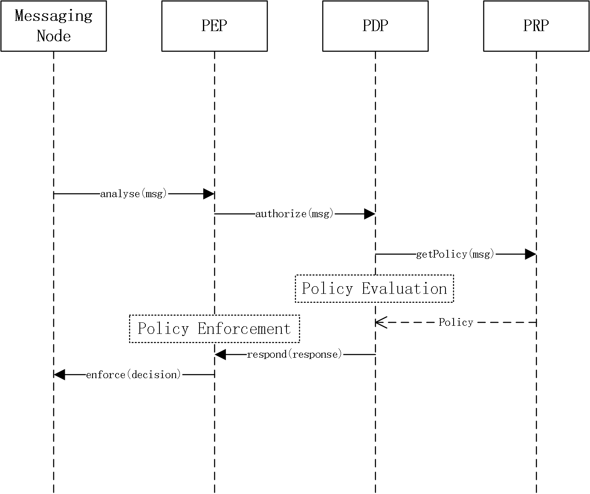
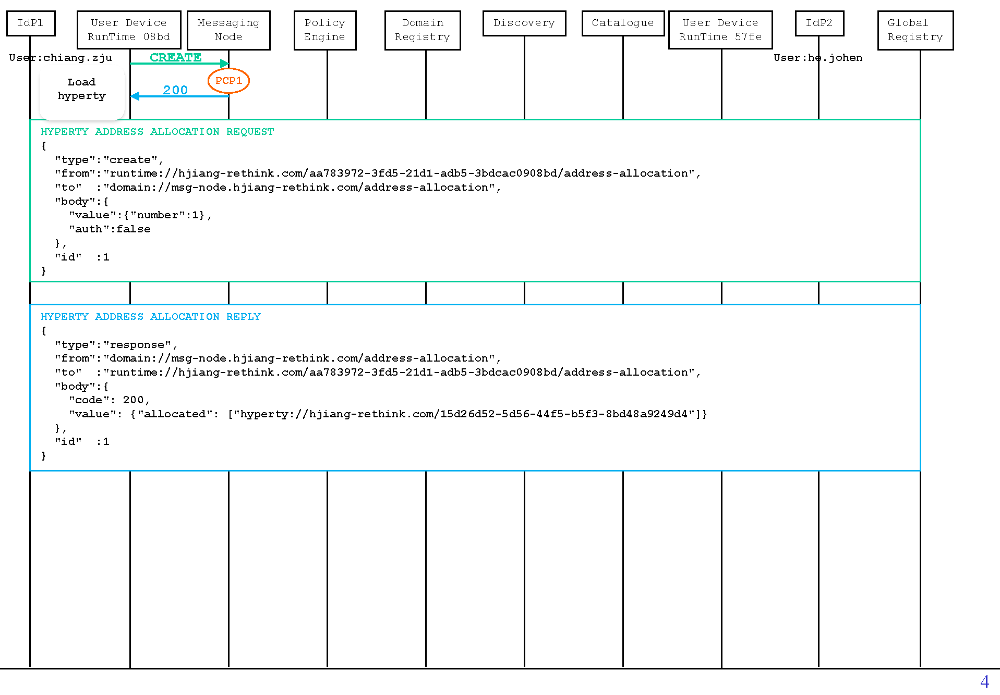
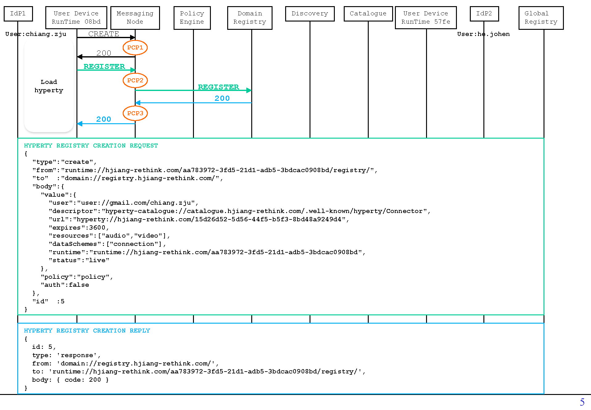
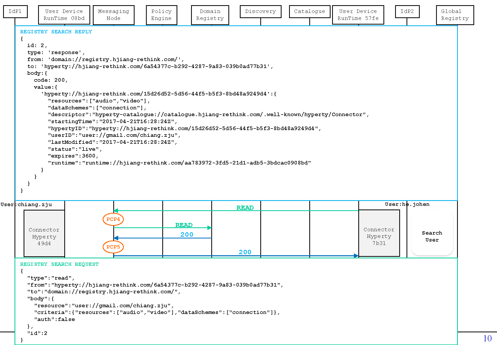
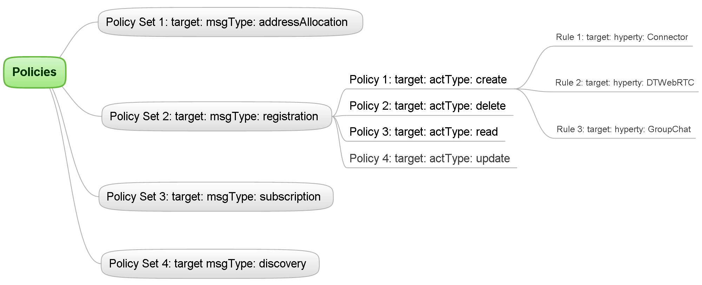

## Policy Engine Assessment

### 1. Introduction

**Policy Engine.** The policy engine follows PEP/PDP architecture, and is currently implemented in the [Node.js-based messaging node](https://github.com/reTHINK-project/dev-msg-node-nodejs) [1] of reThink project. However, by simply invoking the interface of PEP, it is possible to migrate the policy engine to other components of the reTHINK framework. Fig. 1 below indicates the overall architecture of the policy engine.


**Fig. 1 - Policy Engine Architecture**

The Policy Enforcement Point (PEP) is the component in charge of intercepting communication messages and protecting targeted resources by requesting an authorization decision from a Policy Decision Point (PDP) and enforcing that decision. The PDP sits at the very core of the policy engine architecture. It implements the policy description language and evaluation logic. Its purpose is to evaluate authorization requests coming from the PEP against the policies loaded from the Policy Retrieval Point (PRP). The PDP then returns a decision – either of Permit, Deny, or Not Applicable. 

Fig. 2 shows the sequence diagram indicating communication pattern between components of the policy engine.




**Fig. 2 - Sequence Diagram**

For more details concerning the policy engine design and implementation please refer to the README file [here](https://github.com/reTHINK-project/dev-msg-node-nodejs/tree/master/src/main/components/policyEngine) [2] in the policy engine folder of the Node.js MN source code repo.


**JACPoL Policy Language.** JACPoL is a simple but expressive JSON-based language to specify policies. It is specifically designed for turning the needs of access control into meaningful policies that can govern whether and where a request should be blocked, filter which elements of the returned resource it can contain, and constrain the values that can be set for properties. The reTHINK policies are expressed using JACPoL that is tailored to the requirements of reTHINK framework. Policies following this language use a rich vocabulary that gives the ability to configure end user or service provider configurations in an expressive and flexible way. 

JACPoL contains three structural elements, namely Policy Set, Policy, and Rule. The fields of each element and the relationships between them are presented in Fig. 3 as below.


**Fig. 3 - JACPoL Structure**

- A **rule** element defines the target elements to which the rule is applied and details conditions to apply the rule and has three components such as target, effect, and condition. A target element specifies the resources, subjects, actions and the environment to which the rule is applied. A condition element shows the conditions to apply the rule and an effect is the consequence of the rule as either permit or deny.
- A **policy** is the set of rules which are combined with some algorithms. These algorithms are called rule-combining algorithms. For instance "Permit Override" algorithm allows the policy to evaluate to "Permit" if any rule in the policy evaluates to "Permit". A policy also contains target elements which show the subjects, resources, actions, environment that policy is applied.
- A **policy set** consists of Policies combined with policy-combined algorithm. It has also target like a Policy.

Fig. 4 is an example rule: for messages that are of registration msgType and read actType, if the requested resource is user://gmail.com/chiang.zju and the requester is he.johen@gmail.com, then deny.


**Fig. 4 - An Example Rule**

JACPoL provides a simple, flexible, scalable, and expressive attribute-based access control capability, and at the same time supports obligations or advice to enable a set of network management and security features. The detailed syntax and semantics of JACPoL can be found [here](https://github.com/reTHINK-project/dev-msg-node-nodejs/tree/master/src/main/components/policyEngine/prp/policy) [3].


### 2. Methodology Overview

This section introduces methodology and setup for the evaluation of the policy engine. The evaluation is separated into three parts: first is the conformance evaluation to assess the effectiveness of the policy engine with respect to the requirements of reTHINK framework; second is the performance evaluation to test the policy evaluation language in terms of a set of criteria such as processing delay, etc; third is the comparison evaluation, where we comprehensively compare the policy engine with the one for the runtime developed by INESC. For conformance evaluation, we choose the Connector hyperty for demonstration, analyze in details about the signaling messages and phases based on communication sequence diagram. As a result, we have identified for this use case a set of policy control points (PCPs) available for the deployment of different policies. The subsequent section would provide a concrete view of the policies that could be effectively deployed based on these PCPs. For performance evaluation, we  assess the policy language in comparison with the standardized XACML policy language. We conduct repeated tests in order to get reliable results that reflect real performance. For comparison evaluation, we compare key features of the two policy engines in order to clarify their differences in terms of their design and implementation.


### 3. Conformance Evaluation

The connector hyperty is one of the hyperties that are available on the reTHINK testbed. It provides services like user search and WebRTC call. When running on the user device runtime, the hyperty represents for the user as a live instance providing communication services within the reTHINK framework. 

#### 3.1 Message Node Functionalities and Policing Requirements

The Node.js based Messaging Node is one of the reference implementations of the CSP Messaging services in the reTHINK Architecture. The role of Messaging Nodes in the reTHINK Architecture is described in detail in [Hyperty Messaging Framework](https://github.com/reTHINK-project/specs/blob/master/messaging-framework/readme.md). Overall, as part of CSP backend services, it interacts with other rethink CSP backend components like the CSP domain registry, CSP catalogue. 

The message node is responsible for the message delivery at domain level, which is based on a simple message router functionality that performs a lookup for listeners registered to receive the message. The message is posted to all found listeners, which can be other routers/message nodes or the final recipient end-point. Thus, the reThink messaging framework is comprised by a network of routers/message nodes where each router/message node only knows adjacent registered routers/message nodes or end-points. Meanwhile, listeners are programmatically registered and unregistered by routing management functionalities, which take their decisions according to a higher level view of the routing network.

Message nodes are responsible for the interaction of runtimes that might belong to different administrative domains by offering protocol stubs to these external runtimes. The domain operators need a mechanism to control these domain interactions and to potentially block or limit certain combinations of message exchange. In order to achieve this, a MN must provide a hook in the message flow that allows applying policy-based decisions to the routing. These policies must be manageable by the domain Policy Manager. Therefore a Policy Engine provides Policy Decision and Policy Enforcement functionalities at Domain level for incoming and outgoing messages in cooperation with authentication and authorization provided by Identity Management functionalities. It also provides authorization / access control to the Message BUS. 

Overall, the policy engine supports a message node to accomplish the following operations:

- Policy-based inter/intra domain routing. 
- Policy-based functioning and access control of the message node components and support services (including address allocation and subscription management).
- Policy-based functioning (part of) and access control of reTHINK backend services (including Domain Registry, Global Registry and Identity Management support services).


#### 3.2 Policy Control Points and Conformable Policing Examples 

In this section we analyze the connector hyperty use case step by step from the initiation of the call. We assume that the runtime has been downloaded from the right catalogue according to the configuration of the testbed (environment variables), and the Protostub and then the hyperty have been also loaded from the catalogue.

**Phase 1. Hyperty registration**



The first observed message is sent from the runtime to the address allocation manager of the messaging node to request for an address for the just loaded Connector hyperty. Thus the first PCP can be identified for the policy-based control (deny/permit) of this procedure on the message node. At this point, the policy for example can limit the number of requested addresses as expressed below for PCP 1.

- Example 1: for messages of *addressAllocation* msgType and *create* actType, if the requested number of addresses is more than 1, then deny.

```json
{
  "target": {
    "msgType": {"equals": "addressAllocation"},
    "actType": {"equals": "create"}
  },
  "condition": {
    "valueNumber": {"moreThan": 1}
  },
  "effect": "deny"
}
```

In addition, we can also use policies to limit the maximum number of address allocation requests from the same runtime within a period.

- Example 2: for messages of *adddressAllocation* msgType and *create* actType, if the *runtime* has reached the allowed maximum number of requests (50) within a minute, then deny.

```json
{
  "target": {
    "msgType": {"equals": "addressAllocation"},
    "actType": {"equals": "create"}
  },
  "condition": {
    "addrAllastMin": {"moreThan": 50}
  },
  "effect": "deny"
}
```

As there is returned value in the body of the response message, we can thus also define policies at this point to control the returned value.

- Example 3: for messages of *addressAllocation* msgType and *response* actType, if the allocated number of addresses is more than 1, then permit, but limit the number of allocated addresses to 1.

```json
{
  "target": {
    "msgType": {"equals": "addressAllocation"},
    "actType": {"equals": "response"}
  },
  "condition": {
    "valueAllocate": {"moreThan": 1}
  },
  "effect": "permit",
  "obligations": {"limitByNumberOfEntries": {"valueAllocated": 1}}
}
```



The next message is to register the new hyperty to the domain registry with all the necessary information such as its address, user url, runtime url, etc.. Some policies can be to examine the content of the registry entry, or the validity of the requested service for the given user. **Please note** that the functionality-specific policies are better to be deployed on the policy engine of the corresponding reTHINK backend component instead of the message node. For example, a policy as below should be normally deployed on the policy engine of the domain registry:

- Example 4: for messages that are of *registration* msgType and *create* actType, if the user has reached the predefined maximum number of hyperties that it can register (100 for example), or the *expires* value is larger than 3600, then deny.

```json
{
  "target": {
    "msgType": {"equals": "registration"},
    "actType": {"equals": "create"}
  },
  "condition": [
    {"userRegistries": {"moreThan": 100}},
    {"valueExpires": {"moreThan": 3600}}
  ],
  "effect": "deny"
}
```

**However**, it is possible that some part of the policies (e.g., generic policy-based routing and access control) related to reThink backend services could be deployed on the edge (message node) to release these central servers from numerous invalid requests. For example, back to this use case, an apparently invalid registry request can be dropped directly by the message node at PCP 2 instead of being forwarded to the domain registry:

- Example 5: for messages that are of *registration* msgType and *create* actType, if the *value* field does not exists, then deny.

```json
{
  "target": {
    "msgType": {"equals": "registration"},
    "actType": {"equals": "create"}
  },
  "condition": {"bodyValue": {"exists": false}},
  "effect": "deny"
}
```

In addition, there might be needs to limit a user to use only a set of hyperties that are defined in the service agreement. 

- Example 6: for messages that are of *registration* msgType and *create* actType, if the source user tries to register a hyperty that is not Connector, DTWebRTC, or GroupChat, then permit.

```json
{
  "target": {
    "msgType": {"equals": "registration"},
    "actType": {"equals": "create"}
  },
  "condition": {"valueDescriptor": {"not": {"like":["*/Connector","*/DTWebRTC","*/GroupChat"]}}},
  "effect": "permit"
}
```

For PCP 3, as the response message does not contain any other value except for the returned code, there is no point in blocking or modifying the message. Therefore, we did not see any meaningful policy which could be deployed at this point.

Then, another user also tries to register the same hyperty at another device following the same procedure.

**Phase 2. Intra-domain User Discovery**

After that, the two users should have their hyperties loaded and ready. Now we assume that the user *chiang.zju* tries to call the other user *he.johen*. 



First, as we can see the figure above, the caller would send a request of read type to the domain registry to search for the available hyperties of the callee with specific criteria. In return, the domain registry replies with a list of hyperties of the callee that satisfies the criteria. As there might be cases that sometimes the callee wants to configure itself invisible to all others for a specific period of time, we can thus have some policies as examples below for PCP 4:

- Example 7: for messages that are of *registration* msgType and *read* actType, if the targeted *resource* is user *user://gmail.com/chiang.zju* and if it is weekends or between 9 PM and 6 AM of weekdays, then deny.

```json
{
  "target": {
    "msgType": {"equals": "registration"},
    "actType": {"equals": "read"}
  },
  "condition": {
    "resource": {"equals": "user://gmail.com/chiang.zju"},
    "anyOf": [
      {
        "time": {"between": "21:00:00 06:00:00"},
        "weekday": {"not": {"in": ["saturday","sunday"]}}
      },
      {
        "weekday": {"in": ["saturday","sunday"]}
      }
    ]
  },
  "effect": "deny"
}
```

Or if the caller is blacklisted by the callee:

- Example 8: for messages that are of *registration* msgType and *read* actType, if the targeted *resource* is user *user://gmail.com/chiang.zju* and the source user is *he.johen@gmail.com*, then deny.

```json
{
  "target": {
    "msgType": {"equals": "registration"},
    "actType": {"equals": "read"}
  },
  "condition": {
    "resource": {"equals": "user://gmail.com/chiang.zju"},
    "srcUsername": {"equals": "he.johen@gmail.com"}
  },
  "effect": "deny"
}
```

At PCP 5, the policy engine could intercept the returned message which contains a list of hyperties of the callee from domain registry. The policy examples described above could also be implemented at this point:

- Example 9: for messages that are of *registration* msgType and *response* actType, if the *valueUser* is *user://gmail.com/chiang.zju* and the *dstUsername* is *he.johen@gmail.com*, then deny.

```json
{
   "target": {
    "msgType": {"equals": "registration"},
    "actType": {"equals": "response"}
  },
  "condition": {
    "valueUser": {"equals": "user://gmail.com/chiang.zju"},
    "dstUsername": {"equals": "he.johen@gmail.com"}
  },
  "effect": "deny"
}
```

Additionally, we can also deploy other policies with more sophisticated manipulation based on the content of the returned value. For example, the callee may only want some of its hyperties, or a specific hyperty visible to the caller.

- Example 10: for messages that are of *registration* msgType and *response* actType, if the *valueUser* is *user://gmail.com/chiang.zju* and the *dstUsername* is *he.johen@gmail.com*, then permit, but only keep the Connector hyperty in the returned list.

```json
{
   "target": {
    "msgType": {"equals": "registration"},
    "actType": {"equals": "response"}
  },
  "condition": {
    "valueUser": {"equals": "user://gmail.com/chiang.zju"},
    "dstUsername": {"equals": "he.johen@gmail.com"}
  },
  "effect": "permit",
  "obligations": {"limitByConditionOfEntries": {"bodyValue": {"descriptor": {"like": "*/Connector"}}}}
}
```

Until now we have provided sufficient examples on how the reTHINK PDL is implemented to realize different policing requirements for reTHINK. 


### 4. Performance Evaluation

We have evaluated the performance of our policy evaluation language by comparing it with a common policy language XACML. We examine their vertical and horizontal scalabilities respectively in terms of the number of nesting layers (depth) and the number of sibling rules (scale). 


**Fig. 5 - Effect of the number of sibling rules**


**Fig. 6 - Effect of the number of nesting layers**

Each test was repeated 1000 times conducted on a Windows 10 PC with 16G memory and a 2.6GHz Intel core i7-6700HQ processor. From the results we can see that JACPoL is more efficient and scalable and evaluated with less latency than XACML thanks to its JSON syntax and well-defined semantics.


### 5. Comparison Evaluation 

In this section we compare our policy engine with the runtime policy engine developed by INESC.  We summarize the comparison in the table as below:


|                        | [Runtime Policy Engine (INESC)](https://github.com/reTHINK-project/dev-runtime-core/tree/develop/src/policy) | [CSP Policy Engine (IMT-TB)](https://github.com/reTHINK-project/dev-msg-node-nodejs/tree/master/src/main/components/policyEngine) |
| ---------------------- | :--------------------------------------: | :--------------------------------------: |
| Programming Language   |                 Node.js                  |                 Node.js                  |
| Environment            |               Runtime Core               |              Messaging Node              |
| Administrative Domain  |                 End User                 |                   CSP                    |
| Policy Management      |             Locally Defined              |           Remotely Maintained            |
| Policy Language Syntax |                   JSON                   |                   JSON                   |
| Architecture           |                 PDP/PEP                  |             PDP/PEP/PRP/PIP              |
| Access Control Scheme  |                   ABAC                   |                   ABAC                   |
| User Interface         |                   Yes                    |                    No                    |
| Complex Rule           |              Partly Support              |                 Support                  |
| Obligation             |                 Support                  |                 Support                  |
| Context Awareness      |                   Yes                    |                   Yes                    |
| Policy Readability     |                  Medium                  |                   High                   |
| Policy Expressiveness  |                  Medium                  |                   High                   |
| Policy Index           |              Partly Support              |                 Support                  |


As we can see, the two policy engines have the following features in common:

- Both are developed in Node.js.
- Both policy languages follow JSON syntax.
- Both employ ABAC access control scheme.
- Both support obligation and are context sensible.
- Both adopt PEP/PDP architecture.

On the other hand, they have following differences:

- They are designed for different use cases: one is in the runtime browser for the end user and the other is in the backend component for the CSP.
- The runtime policies are managed locally through a user web interface, while the CSP policies are maintained remotely in a repository.
- In addition to PDP, PEP components, the CSP policy engine has additional modules such as PIP and PRP.
- The CSP policy engine does not have a web UI.
- The runtime policy engine does not fully support complex rule or policy index, which would be illustrated further in the subsequent paragraphs.
- At last, although both use JSON syntax, the CSP policy language semantics is more expressive and readable than the runtime policy language.

In the following text we compare policy specification languages of the two policy engines. Please refer to here for more information about [the runtime policy language](https://github.com/reTHINK-project/specs/blob/master/policy-management/runtime/policy-specification-language.md) [5] and here for [the CSP policy language](https://github.com/reTHINK-project/dev-msg-node-nodejs/tree/master/src/main/components/policyEngine/prp/policy) [3]. 


**Readability.** Given the rule as below for example, we can see that for the same rule, the CSP policy language is more readable than the runtime policy.


**Fig. 7 - A runtime rule example (upper) and a CSP rule example (lower) to verify working hours.**


**Expressiveness.** From the above example we can see both policy language can express complex condition using logical operators (AND, OR, NOT) to combine constraints on multiple attributes. However, in addition to that, the CSP policy language also support the following semantics that the runtime policy language does not support:

```json
{"sumOf x y": {"not": {"anyOf": [
        {"between": "j k"},  
        {"equals": "z"}]}}}
```

in which the string "sumOf x y" is an *attribute condition*. The keyword *sumOf* defines a function to compute the sum of attributes *x* and *y*, which is to be evaluated by the subsequent *condition expression*. Please note that a parameter like *j, k* or *z* can also possibly be another attribute instead of an explicit value. In this sense, we can see that the CSP policy language can do more flexible examination on the attributes using various operations.


**Scalability.** Both policy languages support rule index using a *target* field to verify the applicability of a given rule. However, the runtime policy language does not include this concept for policy index, which may cause it less scalable and not efficient.


### 6. Conclusions and recommendations

As we can see from above, the policy engine fulfils access control requirements of reTHINK and at the same time provides good performance results.

In practical application, policies are not a list of independent rules, as it would bring difficulties and inefficiency to policy indexing and management, and a bad design would even introduce conflicts between different rules. On the other hand, a good design of policies, would not only improve the performance of policy engine, but also ease the management work of policies for the administrator. In this section, we provide some guidelines that could be followed when designing policies based on reTHINK PDL.

**- Clarify Policing Needs**

First and foremost, clarify what policies are needed and what to achieve with these policies, with a clear list of all the rules that is planned to be deployed.

**- Classify Policies & Rules**

Generally speaking, rules with similar *targets* (for similar purposes) are put in the same policy, and similar policies are put in the same policy set. When managing policies, it is important to classify carefully different rules and policies in order to form a well structured and layered policy set. Policies could be classified in many ways depending on your policy needs. For instance, in previous examples, most of rules use *msgType* and *actType* in order to index right policies for targeted messages. In such case, we can accordingly construct policies and policy sets based on these two attributes in the *target* fields of rules:



**- Properly Utilize Logical Operators**

Actually as you might already noticed, in the examples above, there are policies which have similar (same) *target* fields. In these cases, rules which have the same *target* field can be possibly combined into one rule with their *condition* fields connected by logical operators (*AND*, *OR*, *NOT*). For example a combination could be done for the two rules as below:

- Rule 1:

```json
{
  "target": {"msgType": {"equals": "addressAllocation"}},
  "condition": {"time": {"between": "23:00:00 01:00:00"}},
  "effect": "deny"
}
```

- Rule 2:

```json
{
  "target": {"msgType": {"equals": "addressAllocation"}},
  "condition": {"addrAllastMin": {"moreThan": 50}},
  "effect": "deny"
}
```

- Combined Rule:

```json
{
  "target": {"msgType": {"equals": "addressAllocation"}},
  "condition": [
    {"addrAllastMin": {"moreThan": 50}},
    {"time": {"between": "23:00:00 01:00:00"}}
  ],
  "effect": "deny"
}
```

Such kind of combination can reduce policy index and process time for a message, and also globally make policies simpler and shorter. Therefore, a proper utilization of logical operators in *target* and *condition* fields is important when designing policies.


### 7. References

- [1] reTHINK Node.js Messaging Node Github Repo. https://github.com/reTHINK-project/dev-msg-node-nodejs
- [2] reTHINK CSP Policy Engine Github Repo. https://github.com/reTHINK-project/dev-msg-node-nodejs/tree/master/src/main/components/policyEngine
- [3] reTHINK CSP Policy Language. https://github.com/reTHINK-project/dev-msg-node-nodejs/tree/master/src/main/components/policyEngine/prp/policy
- [4] reTHINK Runtime Policy Engine Github Repo. https://github.com/reTHINK-project/dev-runtime-core/tree/develop/src/policy
- [5] reTHINK Runtime Policy Language. https://github.com/reTHINK-project/specs/blob/master/policy-management/runtime/policy-specification-language.md
