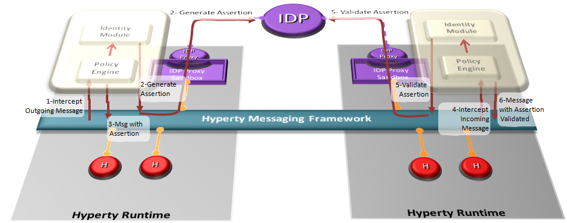

## Trust Management and Security

*to provide here trust / identity management and security related specification defining architectural functionalities and concepts involved. The dynamic view should be updated [here](../dynamic-view/dynamic-view/readme.md) with MSC diagrams and the specification of messages would be provided [here](../messages/identity-management-messages.md)*

This document gives an overview on the Hyperty Trust Model as well as on Hyperty Sandbox runtime execution environment.

Hyperties are securely associated to User Identities selected by the end-user himself. Hyperty Users are human beings (including group of human beings e.g. corporation) or things (including group of things and physical spaces e.g. a smart home or smart building).

Hyperty Trust Model extends [WebRTC Identity model](https://w3c.github.io/webrtc-pc/#sec.identity-proxy) where Identity tokens are generated, inserted in intercepted Messages sent by Hyperties and validated by recipient Hyperty Runtimes before delivered to the target Identity. These identity management procedures are performed according to applicable policies managed by the end-user.

### User Identity

In our modern society, technology is ubiquitous, and transactions are evermore accomplished using digital technologies without the need to involve physical contact. An example of this situation can be observed in money transactions, whilst a few years ago if someone needed to make a bank transfer, it would require that person to move personally into a bank agency to order it, and in current days these money transfers can be performed using a smartphone. To achieve this, we need digital credentials to prove who we are and what we are allowed to do in remote communication. Therefore two important information security mechanisms must be implemented: authentication and authorization.

Authentication is verifying the identity claimed by an actor. Usually, to authenticate users, credentials make use of one or several factors among:

* something a user knows (such as a PIN code or a password),
* something a user owns (such as a SIM card),
* something a user is (such as a fingerprint, or a voice sample),
* something a user does (such as typing characteristics).

Authorization is deciding whether a given identity may execute or access a certain resource. Access control to a service or system, can be achieved based on access rights or policies that allow or deny a particular action based on an identifier, a role (RBAC), or an attribute (ABAC).

Hyperty trust model relies on service-independent authentication that is global and non-service-bound. In implementations, each Hyperty service provider may include their own user recognition (i.e. their own internal user accounts) and service authorization (i.e. level of permissions to use the service), over and above the initial user identification.

### Identity Module and IdP Proxy

The Identity Module (Id Module) is the [Hyperty Core Runtime](https://github.com/reTHINK-project/dev-runtime-core) component responsible for handling the user identity and the association of this identity with the Hyperty instances, in order to make Hyperty instances identifiable. The identity in the reTHINK project is not fixed to a unique Identity Service Provider, but obtained through several different Identity sources. With this approach, the Id Module provides to the user the option to choose the preferred method for authentication. This module will thus able to support multiple Identity acquisition methods, such as OpenID connect 1.0, Kerberos System, or authentication through smart cards. For example, a user with a Google account can use the Google as an Identity Provider to provide Identity Tokens, which can be used by the Identity Module to associate it with a Hyperty instance. Identity proxies are considered to act as intermediaries between the Identity Module and the specific Identity Provider Proxies (IdP Proxy), promoting a more flexible and adaptable solution. The IdP Proxy is the [IDP ProtoStub](hyperty-messaging-framework.md#protocol-on-the-fly-protofly-and-protostubs) that is responsible to handle the communication between the Identity Providers and the Identity Module.

The following figure illustrates this interaction:

### Runtime Sandbox

The hyperty runtime implements sandboxing mechanisms that ensure the correct isolation of client JavaScript code (i.e., Hyperties, ProtoStubs, and Applications). Isolation means that client code is confined to execute within the address space of an independent sandbox. As a result, sandboxes prevent potentially malicious code from interfering with client code instances in co-located sandboxes or from accessing external resources in the surrounding environment (e.g., files, network, etc.). Communication outside the sandbox is possible through well defined channels. Both sandboxing mechanisms and communication channels implemented by the hyperty runtime are available to the application programmer throught specific APIs and are dependent on the targeted platform.

For the browser platform, sandboxing is enforced by leveraging native mechanisms provided by the browser API. The core runtime components execute inside an iFrame. The iFrame implements the core sandbox by isolating the code of the core runtime from the main window in which the application Javascript code is executed. Application code is therefore prevented from accessing directly to the memory address space of the core runtime. Communication between application and core runtime is possible only through a single and well defined entrypoint which allows them to exchange messages: method postMessage(). Hyperties and protoStub downloaded from different domains are executed in independent Web Workers. Web Workers effectively isolate their internal states from each other and from the core runtime. The postMessage() method constitutes the only communication bridge between the these components.

For the standalone platform, the sandboxing mechanisms we employ are similar to the browser platform. The main difference is that, instead of using a browser, we leverage Crosswalk to support standalone applications. Crosswalk is an HTML application runtime that allows us to execute the hyperty runtime as native mobile applications in Android and iOS devices without the need to install a full-blown browser. Mobile applications only need to be bundled with both Crosswalk webviews and the hyperty runtime code. Since a Crosswalk webview implements a Chromium-based runtime, it can seamlessly execute the hyperty runtime code that was implemented for the browser platform.
