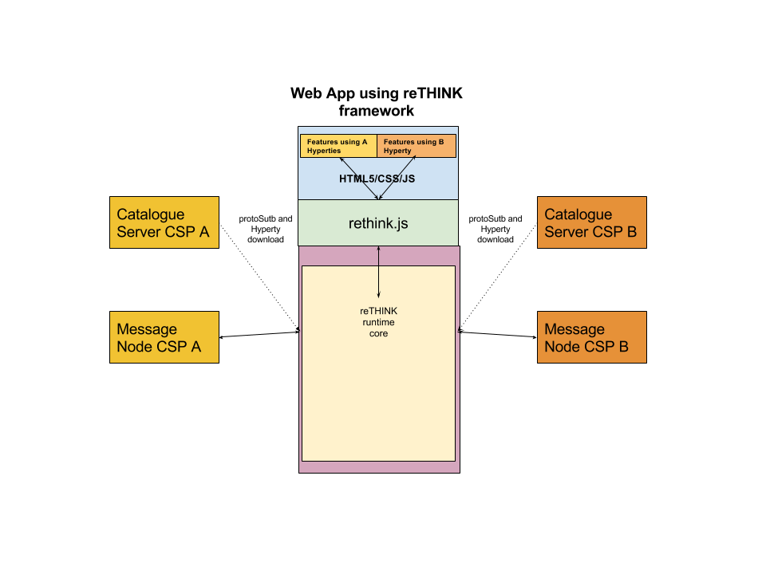

<h1></h1>
<h1></h1>

Developers can use Hyperties in Applications by using any framework or tool, with a few lines of code.

The usage of Hyperties is very simple and similar to the usage of any common Javascript library:

1- the App has to ensure the runtime is instantiated:

You can use through the npm module like:

<pre class="line-numbers">
  <code class="language-shell">
    npm install npm install github:reTHINK-project/dev-runtime-browser#master --save
  </code>
</pre>

<pre class="line-numbers">
  <code class="language-javascript">
  import rethink from 'runtime-browser';
  </code>
</pre>

or you can load through the html script tag

<pre class="line-numbers">
  <code class="language-markup">
    &lt;script src="https://hybroker.rethink.ptinovacao.pt/.well-known/runtime/rethink.js">&lt;/script>
  </code>
</pre>

For both methods you need to do:

<pre class="line-numbers">
  <code class="language-javascript">
    let config = {
      "development": true,
      "runtimeURL": "hyperty-catalogue://hybroker.rethink.ptinovacao.pt/.well-known/runtime/Runtime",
      "domain": "hybroker.rethink.ptinovacao.pt"
    }

    rethink.default.install(config).then(function(result) {

      runtime = result;

      // your code

    }).catch(function(reason) {
      console.error(reason);
    });
  </code>
</pre>

2- then load and deploy the required Hyperty from the Catalogue

<pre class="line-numbers">
  <code class="language-javascript">
    runtime.requireHyperty('hyperty-catalogue://catalogue.example.com/.well-known/hyperty/HelloWorldReporter').then(

      startUsingHpertyDeployed;

      ).catch(function(reason) {
      errorMessage(reason);
    });
  </code>
</pre>

3- and invoke Hyperty functions from its API as a common Javascript Lib:

<pre class="line-numbers">
  <code class="language-javascript">
    startUsingHpertyDeployed(hyperty){
      hyperty.instance.hello(observer);
    }
  </code>
</pre>

## Application vs Hyperty

An Hyperty is a module of software logic that is dynamically deployed in web runtime environments on end user devices, to execute session control and media flow management in a peer to peer manner. They are ready-to-use modules which are instantiated within the reTHINK runtime when required by the application. From the App developer perspective, Hyperties are similar to common Javascript libraries. Hyperty unique characteristics as described [here](../concepts/hyperty.md) are transparent for the App developer. Through the Core Runtime, the required Hyperties and Protostubs are downloaded from the Catalogue server.

The Protostubs are the pieces of code which allows to interact with different messaging protocols. They are downloaded dynamically when the hyperty tries to reach a hyperty belonging to a different Content Service Provider (CSP) which uses a specific protocol for its messaging nodes.

This process is transparent for the developer of the final application, and of course, also for the final user of the application. If the Application requires some functionality or service provided by a Hyperty which has not been downloaded and instantiated yet, the runtime can get the code and instantiate it on the fly. The Application Developer only has to know in advance the Catalogue URL from where Hyperties are downloaded.

## How to adapt existing Applications

### Standard web application

The diagram below shows how a standard application, which interacts with services provided by a service provider, currently looks like. There are several points which are not being considered such as Identity Management issues. If you need to interact with the service provided by CSP A, you need to use the library it provides, you need to authenticate to that specific service and you need to provide the logic in the Web Application to be able to produce and consume data from it.

If the Web App needs to interact with more than one CSP or service, typically it will need to download as many libraries as services and it may need to authenticate against the service provider with several identities and mechanisms. The code from different CSPs is running on the same sandbox so it can potentially interact with code from other libraries. This risk has been mitigated in the reTHINK architecture.

On the other side, we have only considered here Web Apps, but services provided by CSPs can be potentially used from a wide range of devices including constrained devices for M2M application. That is the reason why the reTHINK client libraries has been to be executed also in M2M scenarios where no web browsers are involved.

### reTHINK application

reTHINK web applications are similar to a common Web Application and have no impact at interface level, being impossible for an average user to distinguish between a standard application and a reTHINK application. However there are some settings available that gives the end user the power to make some decisions independently of the App consumed namely in terms of Identity to be used, Contact Lists and personal policies in general.

In the standard application, the developers needs to know in advance the libraries and versions it has to download to build the application. In reTHINK the functionality is provided by hyperties which are dynamically loaded in the runtime on-demand. The interaction with the Hyperties which can be executed in different sandboxes is done through commands and events from the Web application.

The diagram below depicts an Higher level picture of the Core Runtime architecture which is transparent to App developers. This diagram has been created for didactic purposes and it does not include all the elements. For example it does not contain the modules in charge of dealing with identity management.

