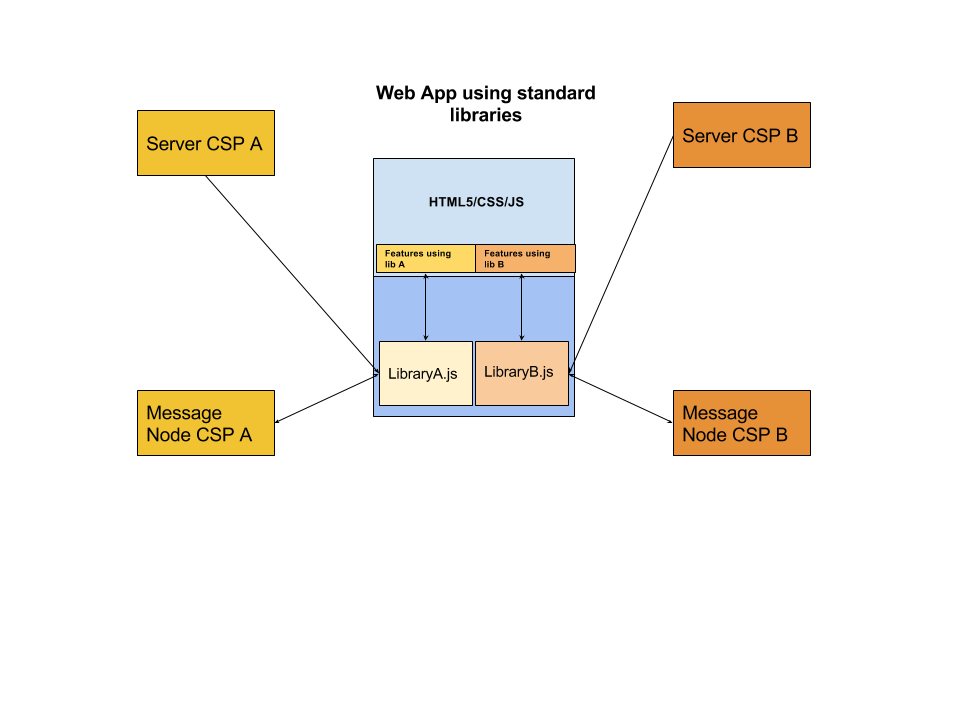
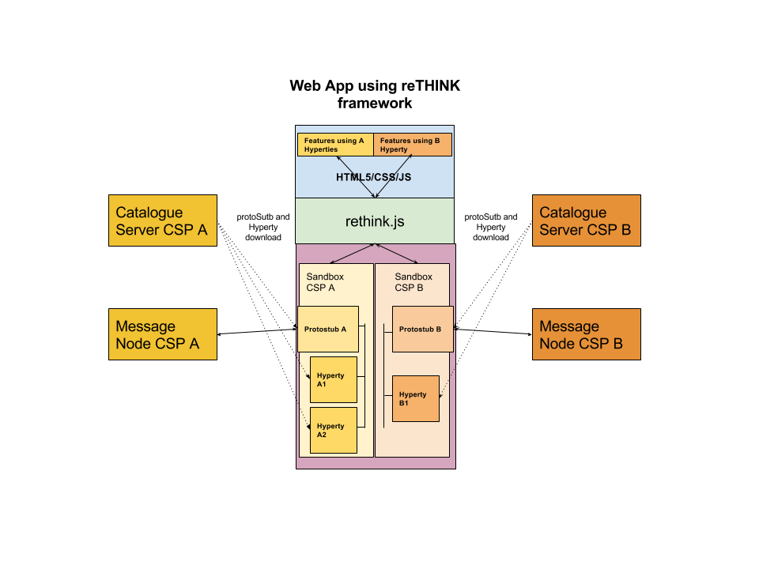

Application Development with Hyperties
-----------------------

### Application vs Hyperty

A Hyperty is a module of software logic that is dynamically deployed in web runtime environments on end user devices, to execute session control and media flow management in a peer to peer manner. They are ready-to-use modules which are instantiated within the reTHINK runtime when required by the application. From the App developer perspective, Hyperties are similar to common Javascript libraries. Hyperty unique characteristics as described [here](hyperty.md) are transparent for the App developer. Through the Core Runtime, the required Hyperties and Protostubs are downloaded from the Catalogue server.

The Protostubs are the pieces of code which allows to interact with different messaging protocols. They are downloaded dynamically when the hyperty tries to reach a hyperty belonging to a different Content Service Provider (CSP) which uses a specific protocol for its messaging nodes.

This process is transparent for the developer of the final application, and of course, also for the final user of the application. If the Application requires some functionality or service provided by a Hyperty which has not been downloaded and instantiated yet, the runtime can get the code and instantiate it on the fly. The Application Developer only has to know in advance the Catalogue URL from where Hyperties are downloaded.


### How to use Hyperties

The usage of Hyperties is very simple and similar to the usage of any common Javascript library:

1- the App has to ensure the runtime is instantiated:

You can use through the npm module like:
```shell
npm install npm install github:reTHINK-project/dev-runtime-browser#master --save
```
```javascript
import rethink from 'runtime-browser';
```

or you can load through the html script tag

```html
<!DOCTYPE html>
<html lang="en">
<head>
    <meta charset="UTF-8">
    <title>Your App Name</title>
</head>
<body>
    <script src="https://<domain>/.well-know/runtime/rethink.js"></script>
</body>
</html>
```

For both methods you need to do:

```javascript
let config = {
  "development": true,
  "runtimeURL": "hyperty-catalogue://hybroker.rethink.ptinovacao.pt/.well-known/runtime/Runtime",
  "domain": "hybroker.rethink.ptinovacao.pt"
}

rethink.install(config).then(function(result) {

  runtime = result;

  // your code

}).catch(function(reason) {
  console.error(reason);
});
```

2- then load and deploy the required Hyperty from the Catalogue

```javascript
runtime.requireHyperty('hyperty-catalogue://catalogue.example.com/.well-known/hyperty/HelloWorldReporter').then(

  startUsingHpertyDeployed;

  ).catch(function(reason) {
  errorMessage(reason);
});
```

3- and invoke Hyperty functions from its API as a common Javascript Lib:

```
startUsingHpertyDeployed(hyperty){
  hyperty.instance.hello();
}

```

### How to adapt existing Applications

#### Standard web application
The diagram below shows how a standard application, which interacts with services provided by a service provider, currently looks like. There are several points which are not being considered such as Identity Management issues. If you need to interact with the service provided by CSP A, you need to use the library it provides, you need to authenticate to that specific service and you need to provide the logic in the Web Application to be able to produce and consume data from it.



If the Web App needs to interact with more than one CSP or service, typically it will need to download as many libraries as services and it may need to authenticate against the service provider with several identities and mechanisms. The code from different CSPs is running on the same sandbox so it can potentially interact with code from other libraries. This risk has been mitigated in the reTHINK architecture.

On the other side, we have only considered here Web Apps, but services provided by CSPs can be potentially used from a wide range of devices including constrained devices for M2M application. That is the reason why the reTHINK client libraries has been to be executed also in M2M scenarios where no web browsers are involved.

#### reTHINK application
reTHINK web applications are similar to a common Web Application and have no impact at interface level, being impossible for an average user to distinguish between a standard application and a reTHINK application. However there are some settings available that gives the end user the power to make some decisions independently of the App consumed namely in terms of Identity to be used, Contact Lists and personal policies in general.


In the standard application, the developers needs to know in advance the libraries and versions it has to download to build the application. In reTHINK the functionality is provided by hyperties which are dynamically loaded in the runtime on-demand. The interaction with the Hyperties which can be executed in different sandboxes is done through commands and events from the Web application.


The diagram below depicts an Higher level picture of the Core Runtime architecture which is transparent to App developers. This diagram has been created for didactic purposes and it does not include all the elements. For example it does not contain the modules in charge of dealing with identity management.




#### Relevant concepts
##### Security: sandboxes
The Web developer does not have to deal with low level details of the architecture. The sandboxes and the management of hyperties and protostubs is done by the core framework. The sandboxes allows to isolate code from different providers reducing the risk of suffering cross-site scripting attacks.
There are special cases where the Hyperty needs to be executed in the same sandbox as the main web application, for example, when the Hyperty needs to access the WebRTC API. These hyperties which are executed in the same sandbox as the main app are called **App Hyperties**. The hyperties which are executed in a different sandbox (a Web Worker in the case of the runtime browser) are called **Service Hyperties**.  

##### Compatibility: Protostubs
In a standard Web Application, the developers needs to know in advance with which services providers it will be necessary to interact. The number of protocols an application can speak is limited in implementation time and it can not change without modifying the code. In reTHINK the protocol-on-the-fly concept is used. If you need to interact with a service which uses protocol A, the framework will provide you on-the-fly a piece of code called protostub which will be executed in the right sandbox. This protostub will speak protocol A and it will expose a common API to the Hyperty Core Runtime. The Web Developer will not need to deal with this complexity.   

##### Identity management.
The identity management is normally coupled to the service logic and there are many different standard protocols for authentication and Identity management that makes it harder to achieve interoperability between different services. The reTHINK framework decouples the service logic from the Identity Management logic and provides a common Identity Management API that is agnostic of protocols used. The protocol-on-the-fly mechanism is also used to provide you on-the-fly the right protostub (here called IDP Proxy) to interact with each Identity Provider selected by the end-user.

#### Admin GUIs

With rethink, you get some services like identity management or policy management. Some of this services can be configured by the user of your application. Rethink injects an iframe on your application that contains the administration GUIs. As an example, you can take a look at [policy manangement administration GUI](../policy-management/user-interface.md).
